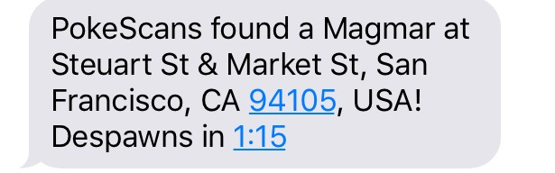
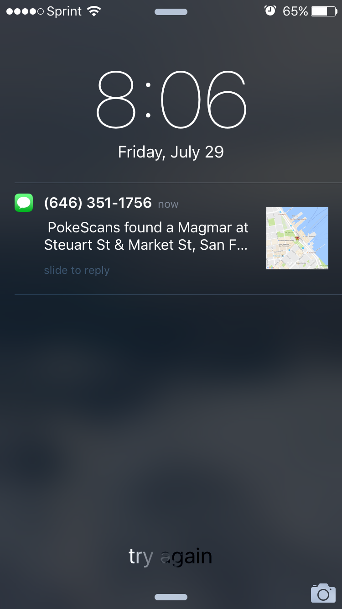
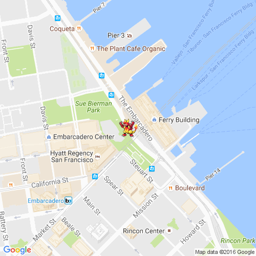

# Pokescans
A scanner with text and email notifications for Pokemon Go.

## Setup Instructions

Prerequisites:
- Twilio account and Twilio number capable of SMS/MMS
- Google Maps API key

1. Clone repo
2. `cp config.example.json config.json`
3. Fill out the values in `config.json`.
  * `timeout` is heartbeat interval, or how long (in milliseconds) to wait between searches
  * `notifications` is an array of types of notifications you wish to receive. You can include `email`, `text`, both or neither.
  * `account` is your Pokemon Go account. This can be a PTC or Google account. Note if you use a Google account, you will need to uncomment the `GetAccessToken` call in `index.js`. This is not needed for PTC accounts.
  * `account.username` your username for PTC or Google
  * `account.password` you know what this is I hope
  * `account.provider` either PTC or Google. If you use Google, you will need to uncomment the `GetAccessToken` call before calling `.init()`. You do not need to supply a callback, as the Google auth token is automatically saved to internal state. PTC auth token is handled automatically.
  * `account.location` The location you want to search in. Roughly ~2 city blocks in all directions from your location.
  * `pokemon` A list of pokemon you want to search for. Must be spelled correctly and use proper capitalization. You use an empty array to target all pokemon.
  * `twilio.sid` Twilio SID - can be retrieved from Twilio dashboard.
  * `twilio.token` Twilio token - can be retrieved from Twilio dashboard.
  * `twilio.number` Twilio phone number. Must be able to accept SMS and MMS.
  * `googleMaps.key` Your Google Maps API key. The rest of the config values should be left as-is.

## ToDo
- [x] Find all pokemon in a given area and filter for targeted 'mons
- [x] Send text notification when specified pokemon is found
- [ ] Send email notification
- [x] Map location of found pokemon with static google map
- [ ] Create map walk algo to search broader space (ideally 2x)
- [ ] Create web interface
- [ ] Create scheduling interface

Thank you to work by Armax (https://github.com/Armax/Pokemon-GO-node-api/) on the Pokemon Go npm package
